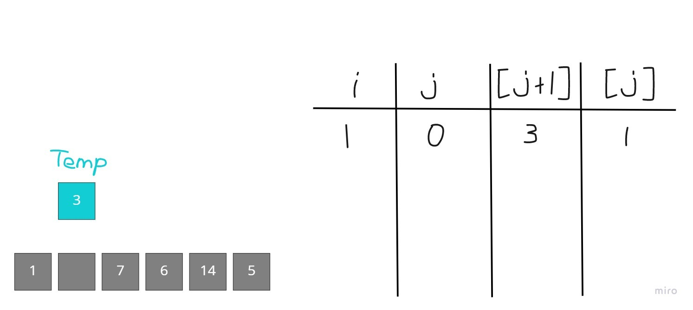
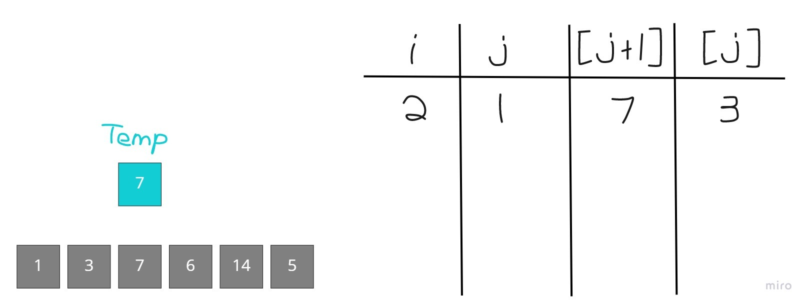
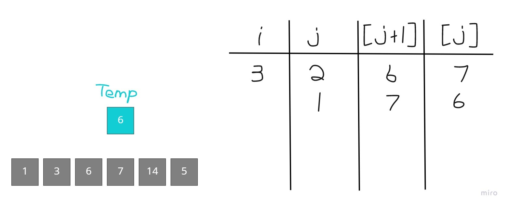
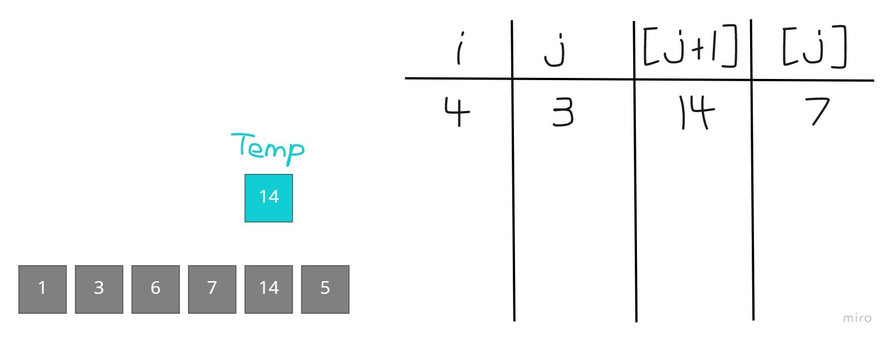

# A Guide To The Insertion Sort Algorithm

## Overview

The insertion sort algorithm pulls out an element and sequentially compares it to each element before it shifting the element being compared to to the right until either an element with a lower value is reached and the removed element can be replaced or the beginning of the list is reached and the removed element is placed at the front.
**Note:** Insertion sort only works if given an already sorted list to add to

## Code

```python
def selection_sort(_list):
    for i in range(1,len(_list)):
        j = i - 1
        temp = _list[i]
        while j >= 0 and temp < _list[j]
            _list[j+1] = _list[j]
            j = j - 1
        arr[j + 1] = temp
```

## In Action



